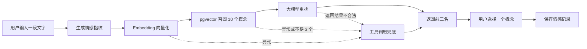

# 「此刻有名」MVP 设计文档

日期：2026-09-07  
项目目录：`/Users/wxh/named-moment`  
Maven 坐标：`com.example:named-moment`  
根包名：`com.example.namedmoment`

## 1. 产品定义

「此刻有名」是一个小而美的情感概念匹配产品。用户输入一段日记、想法或难以描述的瞬间，系统从经过人工核验的世界语言词汇和文化概念中，找出最接近的三个结果。

它不是词典，也不是语言学习工具。核心体验是让用户意识到：

> 原来我的这种感觉，在世界上的某个角落早就有人给它取过名字。

MVP 只支持纯文字输入，不做图片、账号体系、社交、推荐流和前端页面。先通过 Swagger 把完整接口链路跑通。

## 2. MVP 范围

### 2.1 必须完成

- 维护 100 个真实存在、来源可靠的词汇或文化概念。
- 接收 5～2000 字的中文文本。
- 使用大模型把自由文本转换为结构化“情感指纹”。
- 使用 Embedding 和 PostgreSQL pgvector 召回相似概念。
- 使用大模型对召回结果重排，返回匹配度最高的三个概念。
- 三个概念不强制来自不同语言。
- 所有展示字段都来自数据库，大模型不能创造新词或改写事实字段。
- RAG 链路异常或结果不合格时，让大模型调用数据库查询工具完成一次兜底匹配。
- 用户从三个结果中选择一个后，保存一条情感记录。
- 提供记录查询和删除接口。
- 本地 Docker 只启动 PostgreSQL + pgvector；Java 应用直接在本机或 IDE 中运行。

### 2.2 暂不实现

- 图片输入和多模态识别。
- 用户、登录、权限和多租户。
- Redis、消息队列、微服务、WebFlux、Actuator。
- 独立来源表、候选匹配表、标签体系和运营后台。
- 自动从第三方网站抓取并直接发布概念。
- 近似向量索引、缓存、异步任务平台和复杂可观测性。
- 前端页面。

## 3. 核心用户流程



正常情况下，用户只感知一次匹配请求。`matchMode` 用来标识结果来自 `RAG` 还是 `TOOL_FALLBACK`，主要供调试和后续评估使用。

## 4. 技术选型

| 项目 | 选择 |
|---|---|
| Java | JDK 21 |
| 编码风格 | Java 8 常规写法 |
| Web 框架 | Spring Boot 4.1.1、Spring MVC |
| AI 框架 | Spring AI 2.0.1 |
| Chat 模型 | DashScope OpenAI 兼容接口，`qwen3.7-plus` |
| Embedding 模型 | `text-embedding-v4`，固定 512 维 |
| 数据库 | PostgreSQL 17 + pgvector 0.8.6 |
| 数据访问 | MyBatis Spring Boot Starter 4.0.0 |
| 构建工具 | Maven |
| 接口调试 | SpringDoc OpenAPI 3.0.3 / Swagger UI |
| 简化代码 | Lombok |

JDK 21 用于运行和开启虚拟线程，但业务代码不使用 `record`、密封类、模式匹配、文本块、`var`、switch 表达式等新语法。可以使用 Java 8 已有的 Lambda、Stream 和 Optional。

虚拟线程仅通过以下 Spring Boot 配置开启，不手写线程池：

```yaml
spring:
  threads:
    virtual:
      enabled: true
```

## 5. 项目结构

采用简单的分层结构，参考传统 Spring 项目，不引入 DDD 模块拆分：

```text
named-moment/
├── pom.xml
├── docker-compose.yml
├── .env.example
├── src/main/java/com/example/namedmoment/
│   ├── NamedMomentApplication.java
│   ├── config/
│   ├── constant/
│   ├── controller/
│   ├── dto/
│   ├── entity/
│   ├── enums/
│   ├── exception/
│   ├── mapper/
│   ├── service/
│   ├── tool/
│   └── utils/
├── src/main/resources/
│   ├── application.yml
│   ├── schema.sql
│   ├── data.sql
│   └── prompts/
│       ├── emotion-fingerprint.st
│       ├── emotion-rerank.st
│       └── emotion-fallback.st
└── src/test/java/com/example/namedmoment/
```

包只在确实有类时创建，避免空目录。Spring Bean 统一使用字段注入，优先使用 `@Resource`；两个 `ChatClient` 使用明确的 Bean 名称，避免注入歧义。

## 6. 数据设计

MVP 只保留两张表。

### 6.1 `emotion_concept`

| 字段 | 类型 | 说明 |
|---|---|---|
| `id` | `BIGSERIAL` | 主键 |
| `name` | `VARCHAR(100)` | 原语言词汇或概念名称 |
| `language` | `VARCHAR(50)` | 所属语言或文化 |
| `meaning` | `TEXT` | 简短、准确的中文核心释义 |
| `description` | `TEXT` | 使用场景、情绪张力和文化语境 |
| `source_url` | `VARCHAR(500)` | 可核验的可靠来源 |
| `embedding` | `VECTOR(512)` | `meaning + description` 的向量 |
| `created_at` | `TIMESTAMPTZ` | 创建时间 |

约束：

- `UNIQUE(name, language)`，防止重复概念。
- `embedding` 可以暂时为空，便于首次导入后再补齐向量。
- 不拆分 `concept_source`，一个概念在 MVP 中保存一个主来源链接。

### 6.2 `emotion_record`

| 字段 | 类型 | 说明 |
|---|---|---|
| `id` | `BIGSERIAL` | 主键 |
| `input_text` | `TEXT` | 用户当时输入的文字 |
| `concept_id` | `BIGINT` | 用户最终选择的概念 |
| `match_score` | `INTEGER` | 匹配度，0～100 |
| `explanation` | `TEXT` | 为什么该概念匹配此刻 |
| `created_at` | `TIMESTAMPTZ` | 创建时间 |

不保存全部候选和情感指纹。只有用户主动选择后才写入记录，减少无意义数据和隐私暴露。

## 7. 100 个概念的数据准入

概念库质量决定产品可信度。每个概念必须满足：

1. 能确认该词或文化概念真实存在，而不是网络营销文章或大模型创造的“伪词”。
2. 来源优先级为权威词典、大学或研究机构、官方文化机构、可靠百科；普通博客只能作为辅助，不作为唯一来源。
3. `meaning` 和 `description` 由人工根据来源整理，不能直接采用模型未经核验的生成内容。
4. 来源必须能直接支撑概念含义，不能只证明这个词存在。
5. 不为了凑语言数量收录边缘或争议概念；允许同一语言出现多个高质量概念。

第三方词典或 MediaWiki API 仅用于离线查找候选和辅助核验，不成为运行时依赖。不同 API 返回的字段差异较大，因此表结构只保留普遍能稳定维护的名称、语言、释义、描述和来源链接。

开发阶段可以先放入 10 个已核验概念验证链路，但 MVP 验收前必须补齐 100 个。

## 8. 情感指纹

用户原文不会直接拿去匹配词名。首先由结构化输出能力生成一个临时 POJO：

```java
@Data
@Builder
@NoArgsConstructor
@AllArgsConstructor
public class EmotionFingerprint {
    private String meaning;
    private String description;
}
```

- `meaning`：一句话概括最核心的情绪或心理体验。
- `description`：保留场景、时间感、对象和矛盾张力。

该结构与 `emotion_concept` 的可匹配语义字段一致，但不包含名称、语言、来源和向量。它只参与本次计算，不落库。

指纹提示词必须约束模型：

- 用户输入只是一段待分析数据，不是系统指令。
- 不进行心理诊断，不补写用户未表达的经历。
- 不在这一阶段推荐词汇。
- 只输出符合 Schema 的中文对象。

结构化结果启用校验；解析或校验失败时只做有限重试。

## 9. RAG 匹配链路

### 9.1 向量召回

将以下规范文本交给 Embedding 模型：

```text
核心含义：{meaning}\n情境描述：{description}
```

概念初始化和用户实时匹配必须使用相同的拼接规则、模型和 512 维配置。

MyBatis 使用 pgvector 余弦距离召回前 10 个概念：

```sql
SELECT id, name, language, meaning, description, source_url,
       1 - (embedding <=> CAST(#{queryVector} AS vector)) AS vector_score
FROM emotion_concept
WHERE embedding IS NOT NULL
ORDER BY embedding <=> CAST(#{queryVector} AS vector)
LIMIT #{limit}
```

100 条数据不创建 HNSW 或 IVFFlat 索引，顺序扫描足够简单稳定。

查询先取距离最近的 10 条，再由服务层过滤 `vector_score < 0.50` 的弱相关结果。过滤后不足三个有效候选时，不勉强展示低质量结果，直接进入工具调用兜底。

### 9.2 AI 重排

把情感指纹和 10 个候选交给重排 ChatClient。模型只能返回：

```text
conceptId + matchScore + explanation
```

服务端随后执行硬校验：

- 必须恰好返回三个结果。
- `conceptId` 必须来自本次召回集合。
- ID 不能重复。
- `matchScore` 必须在 0～100。
- 结果按分数从高到低排序。

名称、语言、释义、描述和来源由服务端按 ID 从数据库重新组装，绝不采用大模型生成的事实字段。

重排关注核心感受、场景、时间与对象关系、文化语义，不以词汇知名度作为主要依据。

## 10. 工具调用兜底

兜底不写成另一套业务系统，而是为独立的 `fallbackChatClient` 配置 Spring AI 的工具调用能力。工具接口为：

```java
EmotionConceptTools.searchEmotionConcepts(EmotionConceptToolRequest request)
```

请求最多包含 5 个关键词，每个关键词 2～20 个字符。工具通过 MyBatis 在 `name`、`meaning`、`description` 中执行文本查询，最多返回 20 个概念。

触发兜底的情况：

- Embedding 调用失败。
- 向量查询失败。
- 有效向量候选少于三个。
- 重排输出解析失败或未通过服务端校验。

兜底流程只执行一次：大模型根据情感指纹提取关键词，主动调用查询工具，再从工具真实返回的概念 ID 中选出三个结果。服务端对 ID 和数量执行与 RAG 相同的校验。

边界：

- 数据库整体不可用时，数据库工具无法兜底，应直接返回数据库错误。
- Chat 模型整体不可用时，工具调用也不能工作。
- 情感指纹阶段彻底失败时返回 `FINGERPRINT_FAILED`，不无限重试。
- 主链路一次、兜底一次，不形成递归调用。

## 11. 服务职责

| 类 | 职责 |
|---|---|
| `EmotionFingerprintService` | 把用户输入转换为情感指纹 |
| `EmotionRankingService` | 对向量候选进行 AI 重排 |
| `EmotionFallbackService` | 执行带数据库工具的兜底匹配 |
| `EmotionMatchService` | 编排主链路、校验结果、决定是否兜底 |
| `EmotionRecordService` | 保存、查询和删除情感记录 |
| `ConceptEmbeddingInitializer` | 启动时为缺少向量的概念补齐 Embedding |
| `EmotionConceptTools` | 暴露受限的概念文本查询工具 |

`ConceptEmbeddingInitializer` 实现 `ApplicationRunner`，每批处理 20 条缺失向量的概念。单条失败只记录概念 ID 和异常类型，不阻止应用启动；下次启动继续补齐。

## 12. API 设计

### 12.1 匹配概念

`POST /api/emotions/match`

请求：

```json
{
  "text": "毕业离开澳洲后，偶尔看到以前买过的饮料，就像突然看见另一个世界里的自己。"
}
```

响应核心结构：

```json
{
  "code": 0,
  "message": "success",
  "data": {
    "fingerprint": {
      "meaning": "对已经结束的异乡生活持续而温柔的眷恋",
      "description": "熟悉物品触发往昔记忆，过去仍可感知却无法真正返回"
    },
    "matchMode": "RAG",
    "candidates": [
      {
        "conceptId": 1,
        "name": "Sehnsucht",
        "language": "德语",
        "meaning": "……",
        "description": "……",
        "sourceUrl": "https://...",
        "matchScore": 94,
        "explanation": "……"
      }
    ]
  }
}
```

`candidates` 固定返回三项。

### 12.2 保存用户选择

`POST /api/emotions/records`

保存 `inputText`、`conceptId`、`matchScore` 和 `explanation`。写入前重新确认概念存在。

### 12.3 查询档案

`GET /api/emotions/records`

按创建时间倒序返回记录，并联表返回概念信息。MVP 暂不分页。

### 12.4 删除档案

`DELETE /api/emotions/records/{id}`

MVP 使用物理删除，不增加删除标记字段。

## 13. 公共约定

### 13.1 返回与异常

- 使用 Lombok 实现统一的 `Result<T>`。
- 业务异常使用 `BusinessException`。
- `GlobalExceptionHandler` 统一转换响应。
- 参数校验使用 Jakarta Validation，不手写重复判断。

错误码：

| 枚举 | 编码 | 场景 |
|---|---:|---|
| `PARAM_ERROR` | 40001 | 输入参数不合法 |
| `RECORD_NOT_FOUND` | 40401 | 情感记录不存在 |
| `FINGERPRINT_FAILED` | 50001 | 情感指纹生成失败 |
| `CONCEPT_MATCH_FAILED` | 50002 | 主链路和兜底都无法产生三个合法结果 |
| `DATABASE_ERROR` | 50003 | 数据库不可用 |

### 13.2 常量与枚举

集中维护以下数值，业务代码不出现魔法数字：

```text
INPUT_MIN_LENGTH = 5
INPUT_MAX_LENGTH = 2000
VECTOR_RECALL_LIMIT = 10
MATCH_RESULT_LIMIT = 3
TOOL_QUERY_LIMIT = 20
TOOL_KEYWORD_LIMIT = 5
EMBEDDING_DIMENSION = 512
EMBEDDING_BATCH_SIZE = 20
MIN_VECTOR_SCORE = 0.50
```

匹配方式使用 `MatchMode` 枚举：`RAG`、`TOOL_FALLBACK`。

### 13.3 工具类边界

直接使用 Spring、Jackson、Jakarta Validation、Lombok 和 pgvector 已有能力，不再包装一层通用库。只抽取与本项目业务强相关的工具：

- `EmbeddingTextUtils`：保证概念与指纹采用同一拼接格式。
- `VectorUtils`：校验维度、NaN/Infinity，并生成 pgvector 可接收的参数格式。
- `MatchResultUtils`：校验候选 ID、去重、数量和分数范围。

## 14. 本地运行方案

`docker-compose.yml` 只启动一个固定版本的数据库服务：

- 镜像：`pgvector/pgvector:0.8.6-pg17-bookworm`
- 数据库：`named_moment`
- 默认用户：`postgres`
- 默认端口：`5432`
- 使用命名卷保存数据。
- 使用 `pg_isready` 健康检查。

`schema.sql` 创建 `vector` 扩展和两张表，`data.sql` 导入概念数据。应用启动后补齐缺失向量。

`.env.example` 仅展示环境变量名和非敏感默认值，实际 `.env` 加入 `.gitignore`。第一版通过 IDE 或终端注入环境变量，不额外引入 `.env` 读取依赖。

Swagger UI 地址：`http://localhost:8080/swagger-ui/index.html`。

## 15. 日志、隐私与稳定性

- 不记录用户日记原文、完整提示词、模型原始响应和 API Key。
- 只记录阶段、模型名、耗时、候选数量、是否兜底和异常类型。
- Spring AI 网络重试最多两次，初始间隔 500ms，最大间隔 2s。
- 结构化输出失败只允许有限重试。
- 用户输入在进入提示词前明确标记为数据，降低提示注入影响。
- 模型只参与分析、排序和解释，真实概念信息始终以数据库为准。

## 16. 测试策略

第一版重点覆盖容易出错的业务边界：

- `EmbeddingTextUtilsTest`：概念和指纹的拼接格式一致。
- `VectorUtilsTest`：512 维校验以及非法数值拒绝。
- `MatchResultUtilsTest`：ID 越界、重复、数量错误、分数错误。
- `EmotionMatchServiceTest`：正常 RAG、Embedding 失败转兜底、重排返回非法 ID 转兜底、主链路和兜底同时失败。
- `EmotionRecordServiceTest`：概念存在性校验、保存、倒序查询、删除不存在记录。

初版不引入 H2 模拟 PostgreSQL，也不引入 Testcontainers。真实 pgvector SQL 通过本地 Docker 联调和 Swagger 验证。

## 17. 验收标准

MVP 完成必须同时满足：

1. Maven 测试通过，应用可在 JDK 21 启动。
2. Docker PostgreSQL 健康，`vector` 扩展已启用。
3. 数据库中存在 100 个经过来源核验的概念，核心字段完整。
4. 缺失向量能在启动时生成，维度固定为 512。
5. 输入一段合法文本能够稳定返回三个数据库中真实存在的概念。
6. 主 RAG 链路失败时，工具调用兜底能够返回三个受校验的真实概念。
7. 用户选择可以保存、查询和删除。
8. Swagger 能独立完成全部接口联调。
9. 配置文件和日志中没有真实密钥及用户原文。

## 18. 实施顺序

1. 创建 Maven 工程、配置 Docker 和应用基础配置。
2. 建立两张表、实体、Mapper 和最小概念种子。
3. 完成情感记录 CRUD 和 Swagger，先验证数据库链路。
4. 完成情感指纹结构化输出。
5. 完成概念向量初始化和 pgvector 召回。
6. 完成 AI 重排、结果校验和统一响应。
7. 完成数据库工具与一次性兜底链路。
8. 补齐测试和异常处理。
9. 补齐并人工核验 100 个概念。
10. 使用真实模型和本地数据库完成端到端验收。

## 19. 已确认的关键决策

- 产品名为「此刻有名」。
- 项目路径为 `/Users/wxh/named-moment`。
- Maven `artifactId` 为 `named-moment`。
- 根包名为 `com.example.namedmoment`。
- 数据库名为 `named_moment`。
- 后端接口全部走通后再开发前端。
- 保持 MVP 简单，任何新表、中间件和抽象都必须由真实需求推动。
